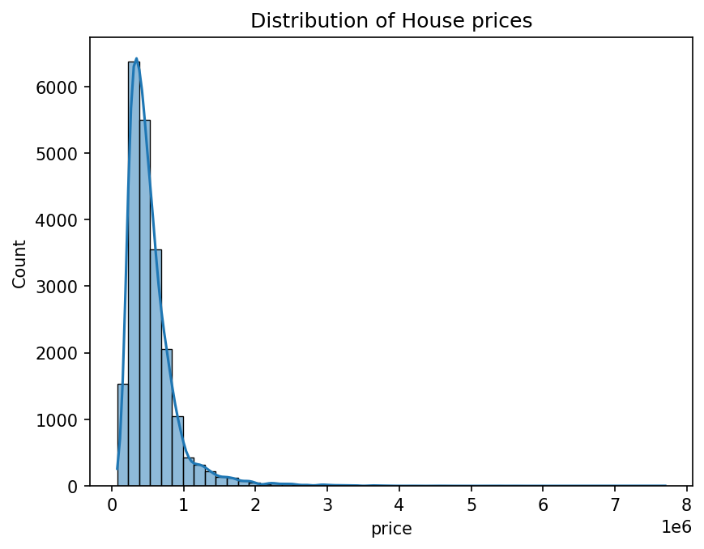
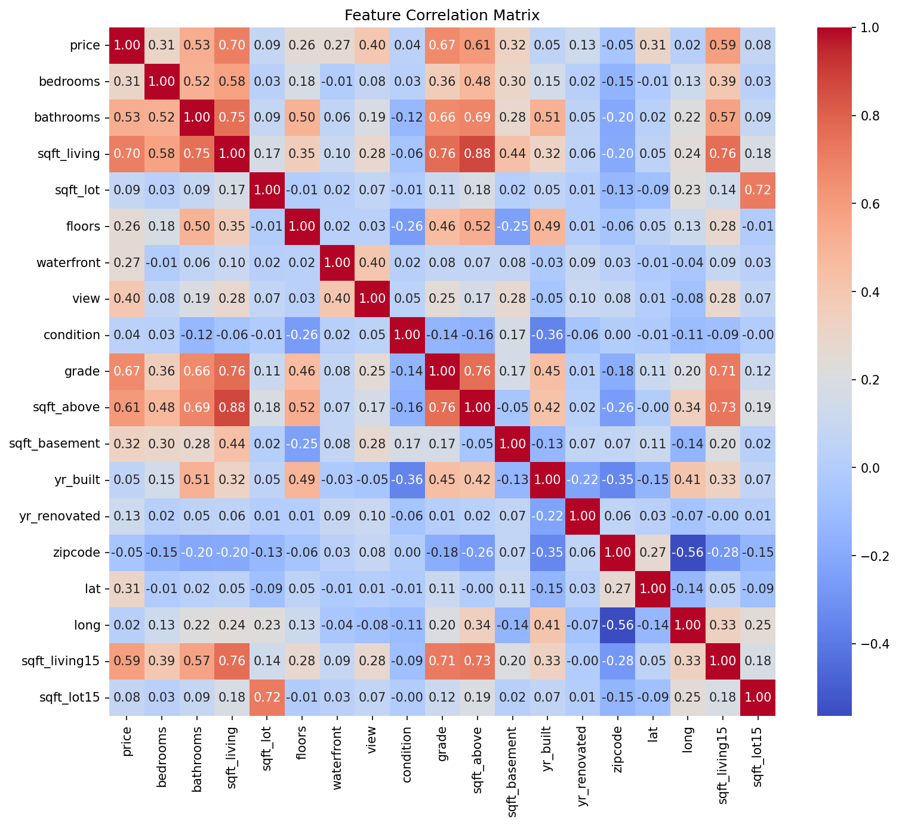
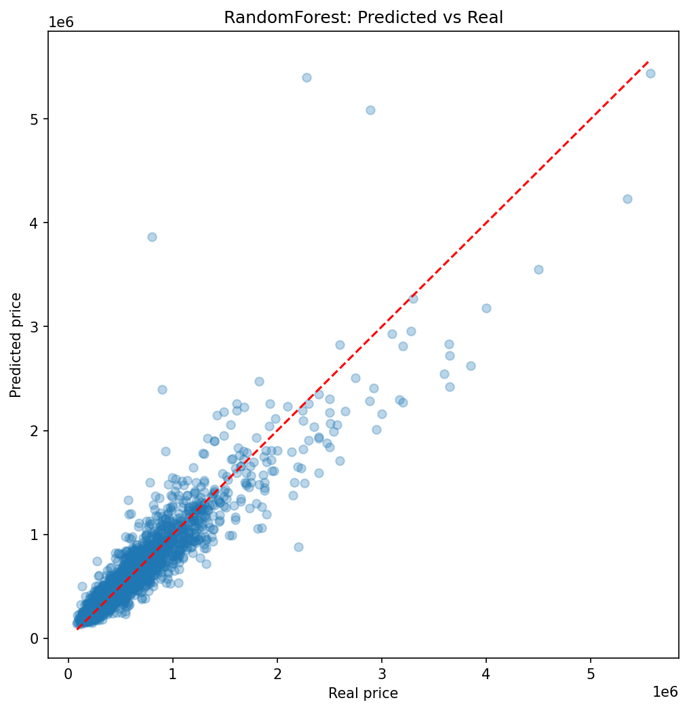

# King County House Price Prediction

## Project Overview

This project analyses house sale prices in King County (Seattle, USA), covering sales from May 2014 to May 2015. The goal is twofold: to **predict house sale prices** using supervised regression, and to **understand which features most influence the price**.

The target variable is `price`, a continuous value, which makes this a **regression** problem (not classification).

## The Data

- **21,613** houses, **21** columns.
- **Target:** `price`.
- **Features include:** `sqft_living`, `bedrooms`, `bathrooms`, `grade`, `sqft_above`, `zipcode`, `lat`, `long`, and others.
- **No missing values** — confirmed with `df.info()`, all columns were complete.
- **Dropped columns:** `id` (a unique identifier with no predictive value) and `date` (text, not used in this first version).

## Exploratory Data Analysis (EDA)

**Price distribution (histogram).** The price distribution is **right-skewed**: most houses sell between ~300K and ~1M, with a long tail of a few very expensive properties reaching up to 8M. Because of this tail, the mean price is higher than the median.

**Feature correlation (heatmap).** A correlation matrix was used to identify which features move most closely with price. The top 5 features correlated with price were:

| Feature | Correlation with price |
|---------------|------|
|  sqft_living  | 0.70 |
|      grade    | 0.67 |
|    sqft_above | 0.61 |
| sqft_living15 | 0.59 |
|   bathrooms   | 0.53 |

**Limitation of correlation.** Four of the top five features describe house *size*, which is largely redundant information. Also, `zipcode` showed near-zero correlation (~-0.05) even though location strongly affects price — this is because Pearson correlation is linear and cannot interpret categorical or geographic values. A machine learning model can capture these relationships.

## Methodology

The supervised pipeline followed these steps:

1. **Load** the data with pandas.
2. **Clean** — drop `id` and `date`, confirm no missing values.
3. **X/y split** — `y = price` (target), `X` = all other columns (features).
4. **Train/test split** — 80% training, 20% testing, `random_state=42` for reproducibility.
5. **Train** the model on the training set.
6. **Predict** prices on the unseen test set.
7. **Evaluate** with regression metrics.

Two models were trained and compared: a baseline **Linear Regression** and a **Random Forest Regressor** (100 trees).

## Models & Results

Both models were evaluated using three regression metrics: **R²** (fraction of price variation explained), **MAE** (mean absolute error in dollars), and **RMSE** (root mean squared error, which penalises large errors more heavily).

| Metric | Linear Regression | Random Forest |
|------|----------|--------------|
| R²   |   0.70   |   **0.85**   |
| MAE  | $127,493 | **$72,750**  |
| RMSE | $212,539 | **$148,583** |

The **Random Forest outperformed Linear Regression across all three metrics.**

The plot below compares the Random Forest's predicted prices against the real prices. Points on the red diagonal are perfect predictions:

## Key Findings

- **Size and grade are the strongest price drivers** — `sqft_living` and `grade` lead both the correlation analysis and the model.
- **The Random Forest is clearly better.** R² rose from 0.70 to 0.85, and the average error per house dropped nearly half (MAE: 127K → 73K). This confirms that house prices follow **non-linear** relationships that a straight-line model cannot capture (for example, the price jump from a waterfront location).
- **The model is weakest on luxury homes.** In the predicted-vs-real plot, predictions stick closely to the diagonal for most houses, but for properties above ~2M the errors grow and become unstable in both directions. There are few houses in that price range for the model to learn from. The high RMSE relative to MAE reflects exactly this — the error lives in the expensive houses.

## Limitations & Next Steps

- **Linear Regression is limited** by its assumption of linear relationships; it fails on expensive houses and ignores geographic structure.
- **Pearson correlation cannot handle geography** — `zipcode`, `lat`, and `long` carry strong price signal that a linear correlation misses.
- **Next steps:** a non-linear model with geographic encoding (e.g. one-hot encoding the zip codes) and a gradient boosting model such as XGBoost, tuned with cross-validation, would likely improve accuracy further — especially on the luxury segment.

## Tools

Python, pandas, scikit-learn, matplotlib, seaborn.
